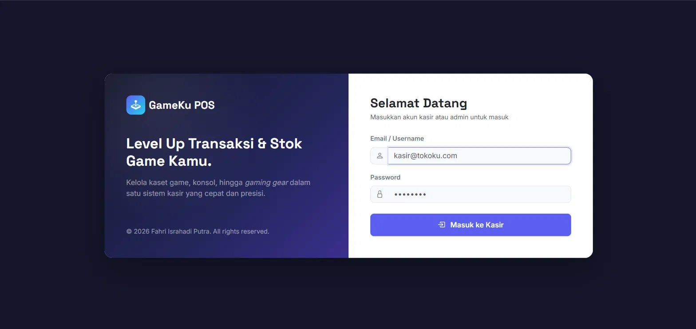
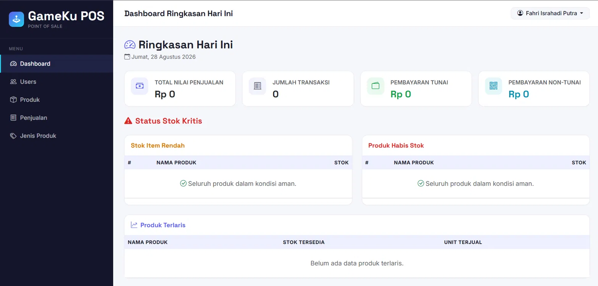
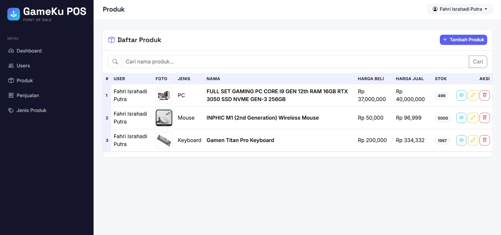
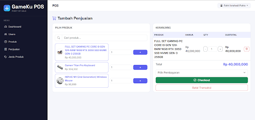
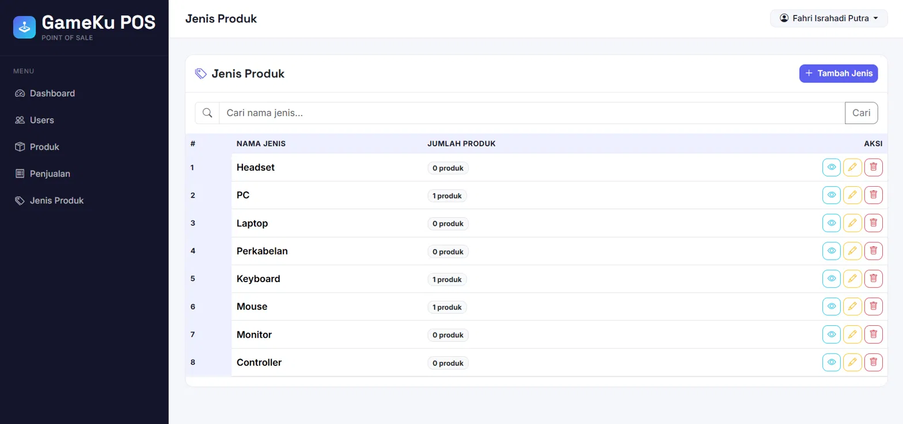
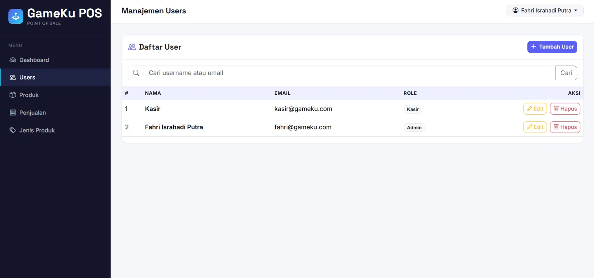
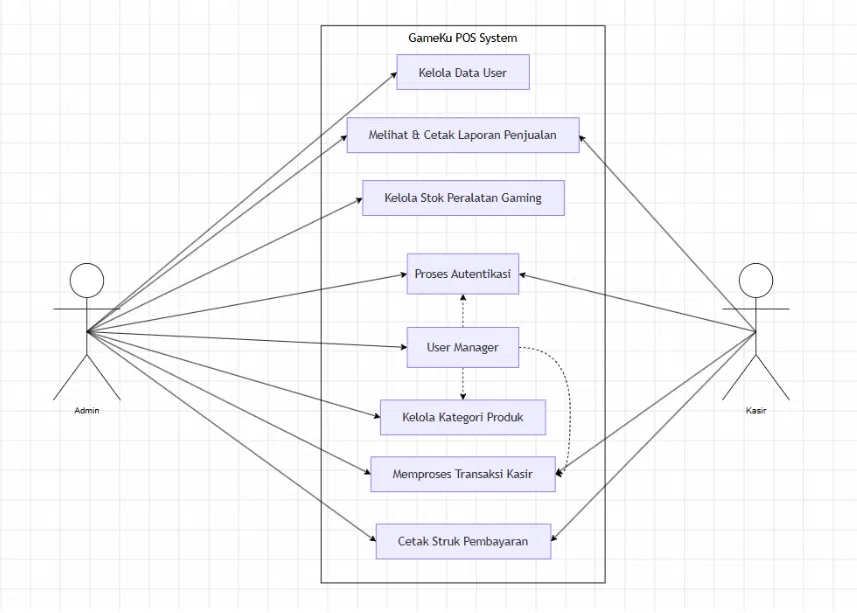
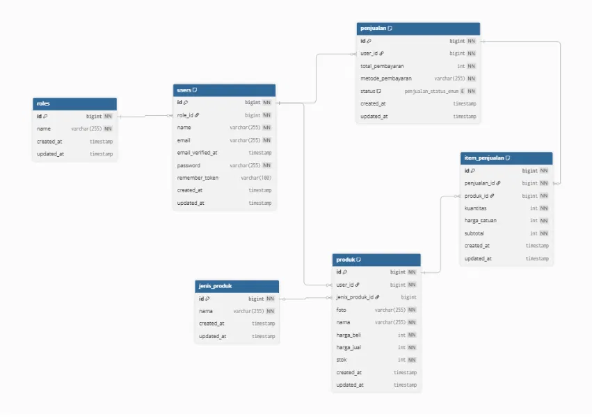

<p align="center">
  
</p>

<h1 align="center">🎮 GameKu POS</h1>
<p align="center"><i>Level Up Transaksi & Stok Game Kamu.</i></p>

<p align="center">
  
  
  
  
  
</p>

---

## 📖 Tentang Aplikasi

**GameKu POS** adalah aplikasi *Point of Sale* (kasir) berbasis web yang dibangun untuk toko peralatan gaming dan elektronik, seperti headset, mouse, keyboard, PC rakitan, hingga laptop. Aplikasi ini dikembangkan menggunakan **Laravel 12** sebagai bagian dari proyek **Uji Kompetensi Keahlian (UKK)** Kompetensi Keahlian Pengembangan Perangkat Lunak dan Gim, SMK Negeri 4 Tasikmalaya.

GameKu POS membantu toko beralih dari pencatatan manual di buku menjadi sistem digital: pencarian produk, penghitungan total transaksi, dan pengelolaan stok dilakukan secara otomatis.

---

## ✨ Fitur

- 🔐 **Autentikasi & Role** — Login dengan dua peran: **Admin** dan **Kasir**, masing-masing dengan hak akses berbeda.
- 📊 **Dashboard** — Ringkasan penjualan hari ini, status stok kritis (stok rendah/habis), dan produk terlaris.
- 🧾 **Transaksi Penjualan (POS)** — Cari produk, tambah ke keranjang, ubah kuantitas, hitung total otomatis, pilih metode pembayaran (Cash/QRIS), lalu cetak struk.
- 📦 **Manajemen Produk** — CRUD produk lengkap dengan unggah foto, harga beli/jual, dan stok.
- 🏷️ **Manajemen Jenis Produk** — Pengelompokan produk berdasarkan kategori.
- 👥 **Manajemen User** — Admin dapat menambah, mengubah, dan menghapus akun pengguna (khusus Admin).
- 📉 **Stok Otomatis** — Stok berkurang saat transaksi berjalan dan otomatis dikembalikan jika transaksi dibatalkan.
- 🖨️ **Cetak Struk** — Bukti transaksi dapat langsung dicetak dari browser.

---

## 🖼️ Tampilan Aplikasi

| Login | Dashboard |
|---|---|
|  |  |

| Manajemen Produk | Transaksi Penjualan (POS) |
|---|---|
|  |  |

| Manajemen Jenis Produk | Manajemen User |
|---|---|
|  |  |

> 💡 Taruh file screenshot kamu di folder `docs/screenshots/` dengan nama sesuai di atas agar gambar tampil otomatis di halaman GitHub.

---

## 🧩 Use Case Diagram

<p align="center">
  
</p>

---

## 🛠️ Tech Stack

| Kategori | Teknologi |
|---|---|
| Bahasa Pemrograman | PHP 8.5 |
| Framework | Laravel 12 |
| Database | MariaDB 11.8.6 |
| Frontend | Bootstrap 5, Bootstrap Icons, Tailwind CSS 4 |
| Build Tool | Vite 6 |
| Dependency Manager | Composer 2.10 |

---

## 🗂️ Struktur Database

Aplikasi ini menggunakan basis data **`pos_fahri`** dengan 6 tabel inti:

| Tabel | Keterangan |
|---|---|
| `roles` | Data role/hak akses (admin, kasir) |
| `users` | Akun pengguna aplikasi |
| `jenis_produk` | Kategori produk |
| `produk` | Data produk beserta stok & harga |
| `penjualan` | Header transaksi penjualan |
| `item_penjualan` | Detail item pada setiap transaksi |

<p align="center">
  
</p>

---

## 🚀 Instalasi & Menjalankan Secara Lokal

### Prasyarat
- PHP >= 8.2
- Composer
- Node.js & NPM
- MySQL / MariaDB

### Langkah-langkah

```bash
# 1. Clone repository
git clone https://github.com/username/gameku-pos.git
cd gameku-pos

# 2. Install dependency PHP
composer install

# 3. Install dependency frontend
npm install
npm run build

# 4. Salin file environment
cp .env.example .env
php artisan key:generate

# 5. Atur koneksi database di file .env
# DB_CONNECTION=mysql
# DB_HOST=127.0.0.1
# DB_PORT=3306
# DB_DATABASE=pos_fahri
# DB_USERNAME=root
# DB_PASSWORD=

# 6. Jalankan migration & seeder
php artisan migrate --seed

# 7. Buat symbolic link untuk storage (WAJIB, agar foto produk tampil)
php artisan storage:link

# 8. Jalankan server
php artisan serve
```

Aplikasi dapat diakses melalui `http://127.0.0.1:8000`.

> ⚠️ **Catatan:** Setiap kali proyek ini di-*clone* ke komputer baru, jalankan ulang `php artisan storage:link`. Symlink ini tidak ikut ter-*commit* ke Git, sehingga tanpa perintah ini foto produk tidak akan muncul.

---

## 👤 Akun Demo

| Role | Email | Password |
|---|---|---|
| Admin | fahri@gameku.com | *(sesuai seeder/database)* |
| Kasir | kasir@gameku.com | *(sesuai seeder/database)* |

---

## 🧪 Pengujian

Pengujian fungsional dilakukan menggunakan metode **Black Box Testing**, mencakup autentikasi, manajemen produk, manajemen jenis produk, manajemen pengguna, hingga proses transaksi penjualan. Detail skenario dan hasil pengujian dapat dilihat pada dokumen lengkap di folder [`docs/`](docs/).

---

## 📄 Dokumentasi Lengkap

Dokumentasi program (analisis, perancangan sistem, ERD, implementasi, dan pengujian) tersedia dalam format Word di:
📁 [`docs/Dokumentasi_GameKu_POS.docx`](docs/Dokumentasi_GameKu_POS.docx)

---

## 🗺️ Rencana Pengembangan

- [ ] Export laporan penjualan ke Excel & PDF
- [ ] Manajemen data supplier & pelanggan
- [ ] Sistem notifikasi stok menipis
- [ ] Dukungan multi-cabang/outlet
- [ ] Automated testing (Unit & Feature Test)

---

## 👨‍💻 Penulis

**Fahri Israhadi Putra**
NIS 242510223 — Kelas XII PPLG 2
SMK Negeri 4 Tasikmalaya — Tahun Pelajaran 2025/2026

Proyek ini dibuat sebagai syarat kelulusan **Uji Kompetensi Keahlian (UKK) RPL**.

---

## 📜 Lisensi

Proyek ini dibuat untuk keperluan pembelajaran/UKK dan dirilis di bawah lisensi [MIT](LICENSE).
